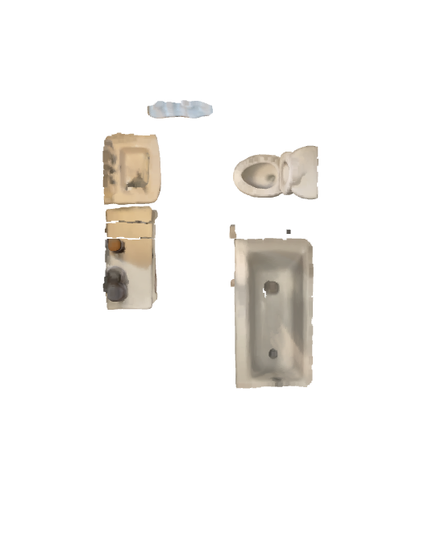

# Plane removal in point cloud data

The goal of this repository is to provide a simple interface for plane removal in point cloud data.

## Setup

### Get example point clouds
This project primarily focuses on room point clouds, which are accessible over the Open3D
File I/O interface. Therefore, [Sketchfab](https://sketchfab.com/search?features=downloadable&q=room+point+cloud&type=models) 
provides free, and downloadable point cloud examples.

### Technical Setup

To set up the folder structure, simply run the commands in the setup.sh from the repository's root folder. After that, place
your point cloud data in the data/raw/ folder for processing. Alternatively, the user can specify
the source and destination path manually in the query. Finally, define the parameters in a config file.
Please find a template file attached to this repository. To query the interface, run the main function
(with the provided flags). 

## Results

State | Raw                                    | Final                                    | 
--- |----------------------------------------|------------------------------------------| 
Pointclouds |  |  | 