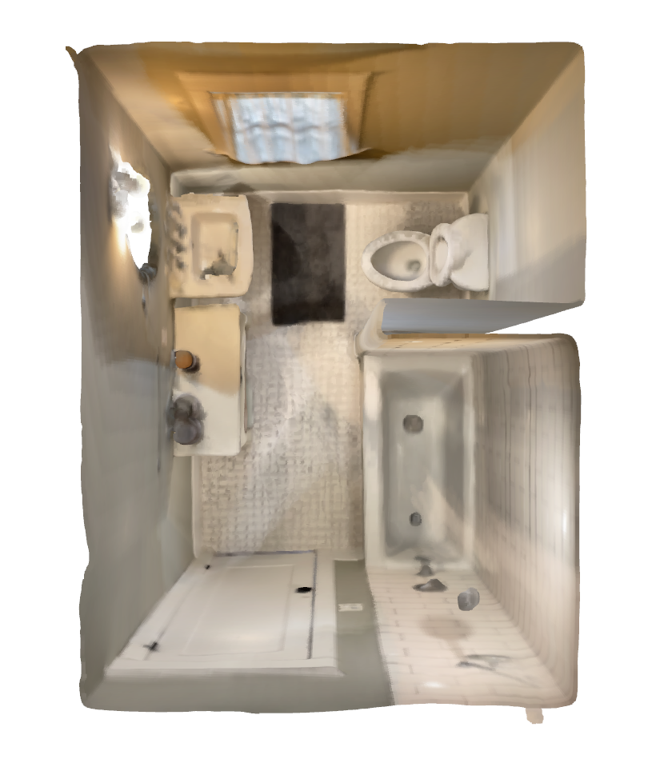

# Plane removal in point cloud data

The goal of this repository is to provide a simple interface for plane removal in point cloud data.

# Setup

## Get example point clouds
This project primarily focuses on room point clouds, which are accessible over the Open3D
File I/O interface. Therefore, [Sketchfab](https://sketchfab.com/search?features=downloadable&q=room+point+cloud&type=models) 
provides free, and downloadable point cloud examples.


## Technical Setup
First, clone the repository from Github:

```
git clone https://github.com/mo12896/plane-detection-in-point-cloud-data.git
```


Next, set up the folder structure for the data:

```
mkdir -p logs data data/raw data/intermediate data/final 
```

within the cloned repository of your choice manually and place your point cloud data in the data/raw! 

### Run from Terminal:

Define the parameters in a config file. Therefore, please find a template attached to this repository. Finally, to call the plane removal, run the main.py (with the provided flags optionally). 

### Run from Docker Image:

Simply run the setup.sh, when you cloned the repository from Github. Otherwise, call the commands manually from your command line. 

# Results

State | Raw                                    | Final                                    | 
--- |----------------------------------------|------------------------------------------| 
Pointclouds |  |  | 